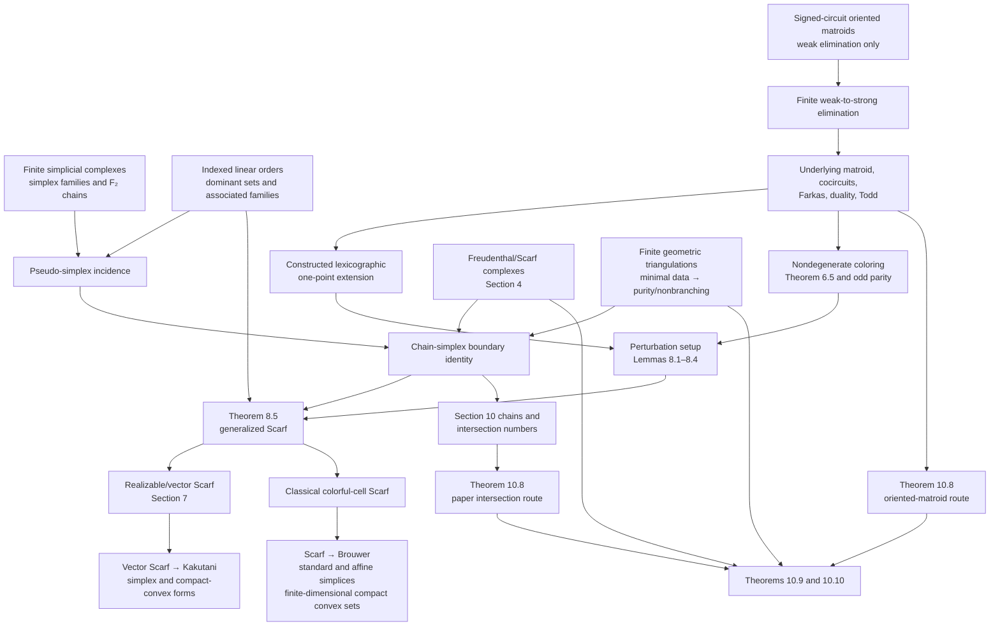

# General Scarf in Lean

[](https://github.com/lyw-ops/General_Scarf/actions/workflows/lean.yml)

This repository contains a Lean formalization of the main dependency structure and applications
in Nikolai Ivanov's [*Scarf's theorems, simplices, and oriented
matroids*](https://arxiv.org/abs/2207.10832).

The repository contains only the `BeyondSperner` development. The separate `Gametheory`
formalization of Brouwer's fixed-point theorem and Nash equilibria is not included here.

## Formalization blueprint

The arrows show how one formalized layer supplies the next theorem or application.



The two Theorem 10.8 nodes are dependency-independent: one follows the paper's intersection-number
route, while the other is supplied by the oriented-matroid coloring route. Both feed the common
Theorem 10.9 and Theorem 10.10 application layers.

## Brouwer fixed-point theorem

The formalized Scarf route now proves Brouwer's fixed-point theorem at three levels:

1. continuous self-maps of a finite standard simplex;
2. continuous self-maps of the convex hull of an arbitrary finite real affine basis;
3. continuous self-maps of any nonempty compact convex subset of an arbitrary
   finite-dimensional real normed space.

The final public theorem is
`BeyondSperner.ScarfBrouwer.scarf_brouwer_fixedPoint_compactConvex`, defined in
[`BeyondSperner/FixedPoint/CompactConvexBrouwer.lean`](BeyondSperner/FixedPoint/CompactConvexBrouwer.lean).
It contains the compact set in a full affine simplex, constructs the nonexpansive nearest-point
retraction in Euclidean space, applies the affine-simplex theorem, and transports the result back
through a continuous linear equivalence. No pre-existing general Brouwer or Schauder fixed-point
theorem is used.

## Kakutani fixed-point theorem

The Section 9 Scarf argument first proves Kakutani's theorem on a finite standard simplex. The
module [`BeyondSperner/FixedPoint/CompactConvexKakutani.lean`](BeyondSperner/FixedPoint/CompactConvexKakutani.lean)
then transports it to every nonempty compact convex subset of an arbitrary finite-dimensional
real normed space. It provides both a closed-graph formulation and the usual compact-valued,
convex-valued, upper-hemicontinuous formulation. The construction reuses the enclosing affine
simplex, Euclidean metric projection, and continuous-linear-equivalence infrastructure; it does
not invoke a pre-existing general Kakutani or Schauder fixed-point theorem.

## Build

The project uses Lean `4.33.0` and mathlib `v4.33.0`, pinned by `lean-toolchain` and
`lake-manifest.json`.

The complete local verification has been run successfully with:

```bash
lake build
lake env lean FormalizationInterface/AuditAll.lean
lake env lean FormalizationInterface/Audit.lean
```

The Lean CI workflow is configured to run the same three commands on pushes to `main`, pull
requests targeting `main`, and manual dispatch.  The badge reports the remote workflow status;
local success and remote CI success are separate checks.

## Repository layout

- [`BeyondSperner.lean`](BeyondSperner.lean) is the umbrella import.
- [`BeyondSperner/`](BeyondSperner/) contains the mathematical formalization.
- [`BeyondSperner/FixedPoint`](BeyondSperner/FixedPoint) contains the Scarf routes to Brouwer and
  Kakutani, including their finite-dimensional compact-convex extensions.
- [`FormalizationInterface/`](FormalizationInterface/) contains theorem-route adapters, status
  documentation, and executable audits.

For a detailed correspondence between the paper and Lean declarations, see
[`FormalizationInterface/BeyondSperner.md`](FormalizationInterface/BeyondSperner.md). For the
formalization status and proof architecture, see
[`FormalizationInterface/STATUS.md`](FormalizationInterface/STATUS.md).
