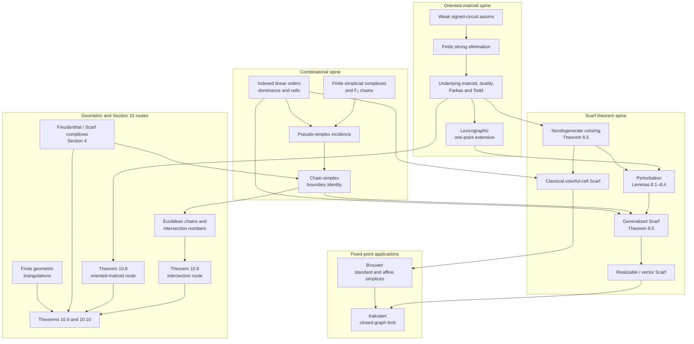

# General Scarf in Lean

This repository contains a Lean formalization of the main dependency structure and applications
in Nikolai Ivanov's [*Scarf's theorems, simplices, and oriented
matroids*](https://arxiv.org/abs/2207.10832).

The repository contains only the `BeyondSperner` development. The separate `Gametheory`
formalization of Brouwer's fixed-point theorem and Nash equilibria is not included here.

## Formalization blueprint

The arrows show how one formalized layer supplies the next theorem or application.



The two Theorem 10.8 nodes are dependency-independent: one follows the paper's intersection-number
route, while the other is supplied by the oriented-matroid coloring route. Both feed the common
Theorem 10.9 and Theorem 10.10 application layers.

## Build

The project uses Lean `4.33.0` and mathlib `v4.33.0`, pinned by `lean-toolchain` and
`lake-manifest.json`.

```bash
lake build
```

The formalization and representative axiom closures can also be checked with:

```bash
lake env lean FormalizationInterface/AuditAll.lean
lake env lean FormalizationInterface/Audit.lean
```

## Repository layout

- [`BeyondSperner.lean`](BeyondSperner.lean) is the umbrella import.
- [`BeyondSperner/`](BeyondSperner/) contains the mathematical formalization.
- [`FormalizationInterface/`](FormalizationInterface/) contains theorem-route adapters, status
  documentation, and executable audits.

For a detailed correspondence between the paper and Lean declarations, see
[`FormalizationInterface/BeyondSperner.md`](FormalizationInterface/BeyondSperner.md). For the
formalization status and proof architecture, see
[`FormalizationInterface/STATUS.md`](FormalizationInterface/STATUS.md).
